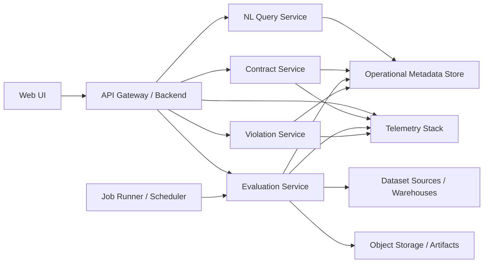

# Delphi

Delphi is a Kubernetes-native Data Observability & Trust platform for defining, tracking, and evaluating data contracts and SLAs.

This repository starts with the product vision, a reference architecture, and an initial scaffold for a proof of concept (POC) focused on contract management, on-demand evaluation, violation tracking, natural language querying, and health visualization.

## Local Run

The current local runnable surface is the backend API plus a Postgres metadata database.

Use Podman Compose from the repository root:

```bash
podman machine start
podman-compose up --build
```

The local databases use Quay-hosted PostgreSQL images so the stack can run in
environments where Docker Hub pulls are blocked or untrusted.

The backend will be available at:

```text
http://localhost:8000/api/health
```

Stop the stack with:

```bash
podman-compose down
```

## Repository Layout

- `docs/product-spec.md`: product requirements and UX intent
- `docs/architecture.md`: system design and service boundaries
- `backend/`: FastAPI scaffold for Delphi APIs and evaluation engine
- `frontend/`: placeholder for the operational UI
- `infra/`: Kubernetes-oriented deployment assets
- `demo_data/`: deterministic source Postgres data for local contract demos

## Local Test Readiness

The supported local stack uses Compose from the repository root. It starts:

- `backend`: FastAPI on `http://localhost:8000`
- `postgres`: Delphi metadata PostgreSQL on host port `5432`
- `demo-source-postgres`: separate source PostgreSQL on host port `5433`

With Podman on macOS:

```bash
podman machine start
podman-compose up --build
```

With Docker:

```bash
docker compose up --build
```

Confirm the backend is healthy from another terminal:

```bash
curl --fail http://localhost:8000/api/health
```

Common local commands are also wrapped in the root `Makefile`:

```bash
make up
make health
make logs
make down
make reset-db
make backend-check
```

To load deterministic demo source data into the Compose-managed source
database:

```bash
make demo-seed
make demo-incremental
```

The backend test and quality path is:

```bash
cd backend
uv run black --check .
uv run ruff check .
uv run pytest tests
```

## Product Vision

Delphi helps data teams answer a simple question with confidence: "Can I trust this dataset right now?"

The platform enables organizations to:

- Define versioned data contracts with SCD Type 6 history
- Evaluate datasets against contracts on-demand
- Track violations and their lifecycle
- Ask natural language questions about dataset health
- Visualize health, SLA status, and contract history

## POC Goals

The POC should prove five things:

1. Contracts can be defined and versioned without losing history.
2. Evaluations can be triggered on-demand for a dataset and contract version.
3. Violations are persisted, visible, and resolvable.
4. Users can understand platform state through both UI and natural language.
5. The system fits naturally into a Kubernetes deployment model.

## Core User Stories

- As a data platform engineer, I can define a contract for a dataset including freshness and row count expectations.
- As a steward, I can update a contract and preserve both current and historical context.
- As an analyst, I can see whether a dataset is healthy before I use it.
- As an operator, I can review active violations and mark them acknowledged or resolved.
- As a stakeholder, I can ask "Which datasets are behind schedule?" and receive grounded answers.

## Functional Scope

### 1. Contract Management

Delphi stores contracts as versioned entities with SCD Type 6 semantics:

- Full historical versions
- Current version flag
- Previous version references
- Effective date ranges
- Derived "current vs prior" comparison fields for reporting

Each contract is attached to a dataset and contains:

- Dataset identity and ownership metadata
- SLA expectations
- Rule definitions
- Status and lifecycle metadata

POC rule types:

- Freshness rule: dataset must be updated within N minutes/hours
- Row count rule: row count must be within min/max or expected variance range

### 2. Evaluation Engine

The evaluation engine runs checks against a selected dataset and contract version.

POC behavior:

- Trigger evaluation through API or UI
- Fetch latest dataset metadata from a target source
- Execute freshness and row count rules
- Persist evaluation results and violations
- Return a health summary

### 3. Violation Tracking

Violations are first-class records linked to:

- Dataset
- Contract
- Contract version
- Evaluation run
- Rule that failed

POC statuses:

- Open
- Acknowledged
- Resolved

Each violation keeps timestamps, assignee/owner metadata, resolution notes, and audit history.

### 4. Natural Language Interface

The natural language layer translates user questions into scoped queries over trusted operational metadata.

Example prompts:

- Which datasets are behind schedule?
- Show datasets with open row count violations.
- What changed between the current and previous contract for `sales.orders`?
- Which datasets have failed more than three times this week?

For the POC, the NL experience should be retrieval-backed and grounded only in platform metadata, not freeform generation over raw warehouse data.

### 5. Health Dashboard

The dashboard should answer:

- What is healthy right now?
- What is failing right now?
- What changed recently?
- Where are the most repeated issues?

POC views:

- Dataset inventory with health status
- Active violations table
- Dataset detail page with latest evaluation
- Contract history timeline
- Current vs previous contract comparison

## Reference Architecture



## Kubernetes-Native Deployment Model

Delphi is designed as a set of containerized services running on Kubernetes:

- `api-gateway`: entry point for UI and client requests
- `contract-service`: manages contract CRUD and versioning
- `evaluation-service`: executes contract rules
- `violation-service`: tracks state transitions for violations
- `nl-query-service`: grounded natural language query interface
- `ui`: dashboard frontend
- `worker` or `job-runner`: async evaluations and scheduled jobs

Recommended Kubernetes primitives:

- `Deployment` for stateless services
- `Job` for on-demand evaluation execution
- `CronJob` for scheduled health checks in later phases
- `ConfigMap` for non-secret runtime configuration
- `Secret` for credentials
- `Ingress` or `Gateway` for external access
- `HorizontalPodAutoscaler` for API and worker scaling

POC deployment guidance:

- Start with a single namespace
- Use one relational metadata store
- Run evaluations as jobs or queue-backed workers
- Emit structured logs and metrics from every service

## Logical Services

### API Gateway / Backend

Responsibilities:

- Authentication and request routing
- Dataset, contract, evaluation, and violation endpoints
- Aggregated responses for the UI

### Contract Service

Responsibilities:

- Create and update contracts
- Manage SCD Type 6 version history
- Return current and prior contract views
- Produce contract diff metadata

### Evaluation Service

Responsibilities:

- Accept evaluation requests
- Resolve target contract version
- Pull dataset metadata from source systems
- Execute rules
- Persist evaluation outputs
- Open or close violations based on results

### Violation Service

Responsibilities:

- Manage violation lifecycle
- Store acknowledgements and resolutions
- Expose active and historical issues

### Natural Language Query Service

Responsibilities:

- Translate user intent into approved query templates
- Query only Delphi metadata
- Return traceable answers with supporting records

For the POC, this service should prefer:

- Intent classification
- Parameter extraction
- Query-template execution
- Answer synthesis over result sets

## Data Model

### Primary Entities

`dataset`

- `dataset_id`
- `dataset_name`
- `domain`
- `owner`
- `source_type`
- `source_location`
- `created_at`

`contract`

- `contract_id`
- `dataset_id`
- `version_number`
- `is_current`
- `effective_from`
- `effective_to`
- `previous_version_id`
- `change_reason`
- `created_at`
- `created_by`

`contract_rule`

- `rule_id`
- `contract_id`
- `rule_type`
- `rule_name`
- `rule_config_json`

`evaluation_run`

- `evaluation_id`
- `dataset_id`
- `contract_id`
- `started_at`
- `completed_at`
- `status`
- `trigger_type`
- `summary_json`

`evaluation_result`

- `result_id`
- `evaluation_id`
- `rule_id`
- `status`
- `observed_value_json`
- `expected_value_json`
- `message`

`violation`

- `violation_id`
- `dataset_id`
- `contract_id`
- `rule_id`
- `evaluation_id`
- `status`
- `opened_at`
- `resolved_at`
- `owner`
- `resolution_note`

### SCD Type 6 Interpretation

For this POC, SCD Type 6 means combining:

- Type 1 behavior for current contract lookup
- Type 2 behavior for full historical versioning
- Type 3 behavior for direct comparison to prior state

That gives us:

- Complete history for auditability
- Fast retrieval of current contract state
- Simple current-versus-previous comparisons in the UI and reports

## API Surface

Suggested POC endpoints:

- `POST /datasets`
- `GET /datasets`
- `GET /datasets/{id}`
- `POST /contracts`
- `PUT /contracts/{id}`
- `GET /datasets/{id}/contracts`
- `GET /contracts/{id}`
- `POST /evaluations`
- `GET /evaluations/{id}`
- `GET /datasets/{id}/health`
- `GET /violations`
- `PATCH /violations/{id}`
- `POST /nl/query`

## User Experience

### Main Screens

1. Dataset Health Dashboard
2. Dataset Detail
3. Contract Editor
4. Contract History & Diff
5. Violations Workbench
6. Natural Language Query Panel

### Healthy UX Principles

- Lead with operational clarity, not marketing language
- Make health states easy to scan
- Keep historical context close to current state
- Show evidence for every answer and status
- Never let the NL interface feel ungrounded

## Non-Functional Requirements

- Kubernetes deployable
- Audit-friendly metadata persistence
- Traceable evaluation outcomes
- Observable service behavior with logs, metrics, and traces
- Clear separation between operational metadata and source datasets
- Extensible rule engine design for future checks

## POC Boundaries

To keep the first implementation tight, the POC should include:

- One or two dataset source adapters
- Two rule types: freshness and row count
- Manual or API-triggered evaluations
- Basic violation workflow
- Dashboard with core health views
- Grounded natural language over metadata only

The POC should exclude for now:

- Full policy engine
- Arbitrary SQL rule authoring
- Automated remediation
- Multi-cluster tenancy
- Complex lineage modeling
- Streaming-specific semantics

## Success Metrics

We will know the POC is working if a user can:

1. Register a dataset.
2. Create a contract.
3. Update the contract and see version history.
4. Trigger an evaluation.
5. Observe pass/fail results.
6. View and resolve a violation.
7. Ask a natural language question and get a grounded answer.

## Suggested Build Sequence

1. Define the metadata schema.
2. Implement contract versioning with SCD Type 6 fields.
3. Build evaluation execution for freshness and row count rules.
4. Add violation lifecycle management.
5. Build dashboard APIs and a minimal UI.
6. Add grounded NL query support.
7. Package services for Kubernetes deployment.

## Suggested Tech Stack

One pragmatic POC stack:

- Backend: FastAPI or Node.js service layer
- Metadata store: PostgreSQL
- Async execution: Kubernetes Jobs or a queue-backed worker
- UI: React dashboard
- NL layer: LLM + query templates over operational metadata
- Observability: OpenTelemetry + Prometheus/Grafana

## What Comes Next

Natural next artifacts for this repository:

- Product requirements document
- Service boundary ADR
- Metadata schema DDL
- API specification
- Kubernetes manifests or Helm chart
- UI wireframes
