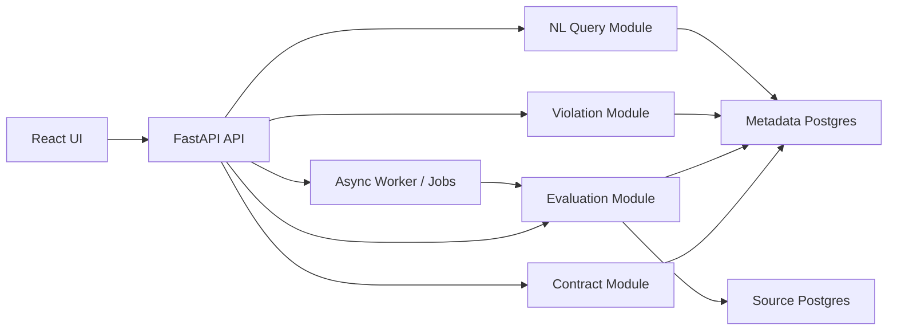
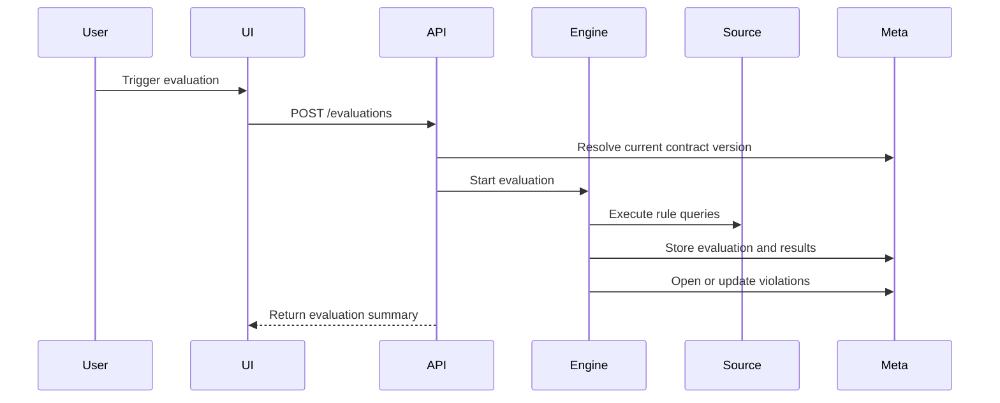

# Delphi Architecture

## Overview

Delphi is a Kubernetes-native internal platform for data observability and trust. The POC uses FastAPI services, PostgreSQL for metadata persistence, PostgreSQL as the first evaluated source system, and a UI that triggers evaluations through the backend.

## Architectural Priorities

- Keep operational metadata as the system of record
- Separate contract state from evaluation results and violation state
- Make rule execution extensible
- Keep natural language querying grounded to approved metadata queries
- Preserve full historical context for contracts and evaluations

## High-Level Topology



## Service Design

For the initial scaffold, Delphi can begin as a modular monolith with clear boundaries inside one FastAPI application. This keeps the first iteration simple while preserving a path toward service extraction.

Logical modules:

- dataset registry
- contract management
- evaluation engine
- violation management
- natural language query service
- dashboard/query aggregation

## Deployment Model

### Phase 1

Run as:

- one backend deployment
- one UI deployment
- one PostgreSQL instance for Delphi metadata
- one PostgreSQL source connection for evaluated datasets

### Phase 2

Split into:

- API deployment
- async worker deployment
- optional scheduler or `CronJob`

## Data Storage

### Metadata Store

PostgreSQL stores:

- datasets
- contracts and versions
- rules
- evaluations
- evaluation results
- violations
- NL query audit records later if desired

### Source Connectivity

The POC uses PostgreSQL as the source system under evaluation. Source credentials are configured at the application level.

## Contract Versioning

Delphi uses SCD Type 6 semantics to support:

- current version lookup
- historical version retention
- comparison to the previous version

Practical interpretation:

- current version row behaves like Type 1 access for reads
- each meaningful change inserts a new version row like Type 2
- prior version reference supports Type 3 style comparison fields

Versioning is triggered only by:

- SLA changes
- rule additions
- rule removals
- rule definition changes
- severity changes

Non-versioning updates may include presentation-only metadata in later phases.

## Rule Engine Design

The rule engine should use a common interface:

- resolve dataset context
- execute rule
- normalize result into pass/fail
- persist evidence

Suggested rule interface:

```python
class RuleExecutor(Protocol):
    rule_type: str

    async def evaluate(self, context: EvaluationContext, rule: ContractRule) -> RuleOutcome:
        ...
```

### Supported Rule Types

#### Freshness

Configurable inputs:

- timestamp column
- acceptable lag interval
- evaluation strategy

#### Row Count

Configurable inputs:

- min value
- max value
- expected range
- prior-run comparison bounds

#### Custom SQL

Configurable inputs:

- raw SQL text
- optional result expectation metadata

The result must be normalized to pass/fail. The initial implementation can require SQL that returns either:

- zero rows for pass and one or more rows for fail
- one boolean-compatible result row

That constraint gives us safe normalization without overcomplicating the first release.

## Evaluation Flow



## Violation Lifecycle

Violation key behavior:

- one active violation per failing rule
- repeated failures update the same open violation
- acknowledged violations remain open until resolved
- resolved violations remain in history and new failures can open a new violation record

State transitions:

- `open -> acknowledged`
- `open -> resolved`
- `acknowledged -> resolved`

## Natural Language Architecture

The NL layer should be grounded through controlled query generation rather than direct database exploration by the model.

Pipeline:

1. classify intent
2. extract entities and filters
3. map to an approved query template
4. execute against metadata store
5. synthesize response
6. attach evidence records

This is a better fit for the POC than agentic querying because it keeps answers bounded and inspectable.

## API Boundaries

Suggested resources:

- `/datasets`
- `/contracts`
- `/evaluations`
- `/violations`
- `/health`
- `/nl/query`

Suggested backend layers:

- router
- service
- repository
- schema
- domain model

## Frontend Shape

The UI should be a dense internal tool, not a marketing shell.

Core screens:

- overview dashboard
- dataset detail page
- contract editor
- contract history diff
- violations workbench
- ask Delphi panel

The overview page should foreground:

- healthy versus unhealthy counts
- open violations by severity
- scan-friendly dataset list

## Observability

The first implementation should emit:

- structured logs
- request metrics
- evaluation duration metrics
- rule pass/fail counts
- violation counts by status and severity

## Security Posture for POC

The POC can omit authentication, but it should still:

- isolate source credentials from user inputs
- validate SQL authoring inputs before execution
- limit custom SQL execution to registered dataset connections
- avoid exposing arbitrary metadata queries through the NL layer

## Repository Strategy

Initial repository structure:

- `docs/` for product and architecture artifacts
- `backend/` for FastAPI application
- `frontend/` for UI scaffold
- `infra/` for Kubernetes manifests

This keeps the repo ready for iterative implementation without pretending the architecture is more distributed than it is today.
