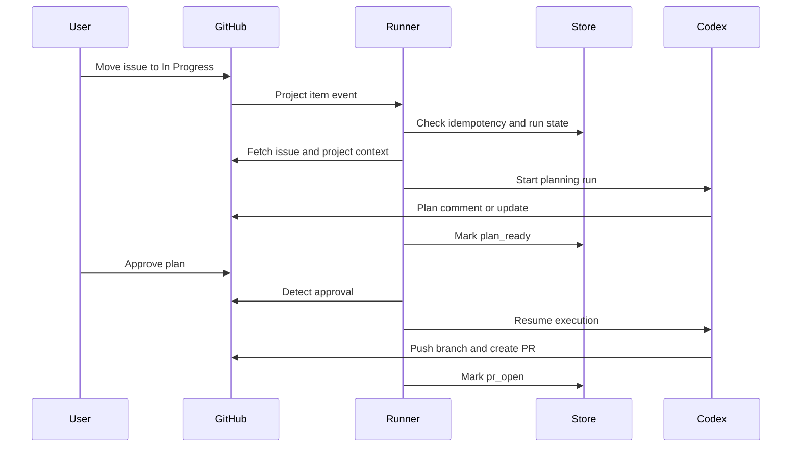
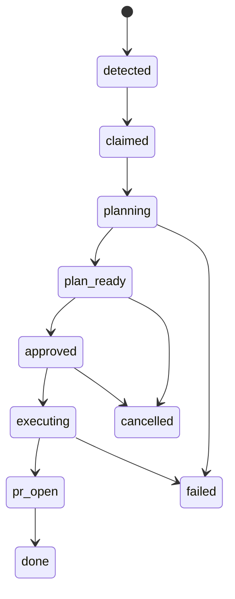

# Delphi Issue Runner Technical Design

## Summary

This document defines the Phase 2 design for an issue-driven Codex runner for Delphi.

The runner starts work only after a GitHub issue is deliberately moved to `In Progress` on the organization project board, generates a plan for approval, and only then proceeds with implementation and PR creation.

The goal is to create a safe, reviewable automation path that avoids accidental chain reactions while reducing the manual overhead of starting work on approved tickets.

## Goals

- Start Codex work only from a deliberate project workflow signal
- Use organization-project events rather than issue-open events
- Require explicit plan approval before implementation
- Prevent duplicate sessions and ambiguous branch state
- Keep GitHub issue, branch, plan, and PR state traceable
- Align with the existing Delphi `delphi-work-issue` and `delphi-github-workflow` skills

## Non-Goals

- Full autonomous issue intake from newly opened issues
- Automatic implementation without a plan approval gate
- Complex multi-issue orchestration
- Generic multi-repo agent infrastructure beyond what Delphi needs first
- Replacement of GitHub project workflow with a custom workflow system

## Trigger Model

### Source of truth

The source of truth for work intake is:

- GitHub organization project `oci-ai-incubations/17`

### Trigger condition

The runner starts only when:

- a project item representing a GitHub issue transitions to `In Progress`

It must not start on:

- issue creation
- issue edits
- label changes alone
- arbitrary comments

### Why this trigger

This model creates an explicit human gate before automation starts and avoids runaway issue-processing behavior.

## High-Level Flow

## System Components

### 1. Webhook Receiver

Responsibilities:

- receive GitHub webhook events
- verify webhook signature
- filter for project-related events
- normalize the payload into an internal event

Inputs:

- GitHub organization project events related to project item changes

Outputs:

- internal runner event such as `issue_moved_to_in_progress`

### 2. Event Filter

Responsibilities:

- confirm the event belongs to project `17`
- confirm the item is a GitHub issue
- confirm the status changed to `In Progress`
- ignore irrelevant transitions

This layer should be intentionally strict.

### 3. Run State Store

Responsibilities:

- ensure one active run per issue
- track the phase of work
- support resume after plan approval
- prevent duplicate handling from repeated webhook deliveries

Recommended first implementation:

- PostgreSQL table in a small runner service database

Acceptable early fallback:

- SQLite if the runner is initially single-instance

### 4. GitHub Adapter

Responsibilities:

- fetch issue details
- fetch project item metadata
- post plan comments
- inspect comments for approval
- update issue or project state later if needed
- open PR links or comments when not handled directly by Codex

Use:

- GitHub GraphQL API for project-specific metadata
- GitHub REST or `gh` CLI for issue and PR operations where practical

### 5. Codex Executor

Responsibilities:

- start a plan-generation run for the target issue
- start or resume the implementation run after approval
- run in a checked-out working directory with git access

Recommended first implementation:

- a dedicated worker host or container that invokes Codex locally or through the chosen Codex execution interface

Responsibilities during planning:

- fetch issue context
- create branch
- draft plan
- stop for approval

Responsibilities during execution:

- implement approved plan
- run relevant checks
- push branch
- open PR

### 6. Approval Watcher

Responsibilities:

- detect explicit user approval after plan publication
- resume the run only after approval is present

Recommended first approval mechanism:

- issue comment containing a clear approval token such as `approved`

Why this first:

- simple to implement
- visible in GitHub
- explicit and auditable

## State Model

The runner should manage a small explicit state machine.

### States

- `detected`
- `claimed`
- `planning`
- `plan_ready`
- `approved`
- `executing`
- `pr_open`
- `done`
- `failed`
- `cancelled`

### State transitions

### Idempotency rules

- repeated deliveries of the same project event must not create multiple runs
- only one active non-terminal run may exist per issue
- a new `In Progress` event for an already-claimed issue should be ignored unless the prior run is terminal or explicitly cancelled

## Data Model

Suggested first table: `issue_runner_run`

Fields:

- `run_id`
- `repo_owner`
- `repo_name`
- `issue_number`
- `issue_node_id`
- `project_number`
- `project_item_id`
- `trigger_status`
- `branch_name`
- `state`
- `plan_comment_id`
- `approval_comment_id`
- `pr_number`
- `pr_url`
- `codex_session_ref`
- `detected_at`
- `updated_at`
- `error_message`

Optional later table: `issue_runner_event_log`

Purpose:

- retain raw or normalized event history for debugging and auditability

## GitHub Integration Design

### Project event intake

Preferred source:

- organization-project item events for project `17`

The runner should normalize event data into:

- project id
- project item id
- linked issue id
- old status
- new status

### Issue detail fetch

For each triggered issue, fetch:

- issue number
- title
- body
- labels
- assignees
- comments
- repository information

### Plan publication

The first implementation should post the plan as an issue comment.

The plan comment should include:

- branch name
- concise implementation plan
- intended verification
- explicit approval instructions

Suggested approval instruction:

- comment `approved` on this issue to start execution

### PR linkage

The implementation PR should contain:

- `Closes #<issue-number>` or `Fixes #<issue-number>`

The runner or Codex should also post the PR URL back to the issue once created.

## Codex Execution Design

### Planning run

Inputs:

- repo path or cloned worktree
- issue number and issue text
- repo-local playbook under `.codex/`
- instruction to use `delphi-work-issue`

Outputs:

- working branch
- implementation plan
- optional issue comment with plan

### Execution run

Inputs:

- prior run state
- approved plan
- branch context
- issue number

Outputs:

- code changes
- verification results
- pushed branch
- PR URL

### Branch naming

Use:

- `codex/issue-<number>-<slug>`

The runner should reserve and persist the branch name when planning starts.

## Failure Handling

### Event-level failures

Examples:

- malformed webhook payload
- unknown project item shape
- issue no longer exists

Handling:

- log and mark the event as ignored or failed
- do not retry blindly if the payload is invalid

### Planning failures

Examples:

- branch cannot be created
- GitHub auth missing
- Codex executor fails before plan publication

Handling:

- mark run `failed`
- post a short issue comment if appropriate
- avoid auto-retrying until a human intervenes or explicitly retries

### Approval timeout

Examples:

- plan remains unapproved for too long

Handling:

- keep the run in `plan_ready`
- optionally alert or mark stale after a threshold
- do not auto-cancel too aggressively in the first version

### Execution failures

Examples:

- tests fail
- push fails
- PR creation fails

Handling:

- mark run `failed`
- persist error detail
- surface outcome clearly in GitHub or runner logs

## Security and Safety

- verify GitHub webhook signatures
- use least-privilege GitHub credentials
- separate GitHub app credentials from repo secrets
- do not execute arbitrary code from issue comments beyond the explicit approval token
- do not allow issue text alone to bypass plan approval
- isolate runner execution environment from unrelated repos or credentials

## Observability

The runner should emit:

- webhook receipt logs
- normalized event logs
- state transition logs
- Codex run start and end logs
- approval detection logs
- PR creation logs

Metrics to track:

- events received
- runs started
- plans posted
- approvals received
- PRs opened
- failures by phase
- duplicate events ignored

## Rollout Plan

### Phase 2A: Plan-only automation

Build:

- webhook receiver
- event filter
- run state store
- GitHub adapter
- Codex planning run only
- plan comment publication

Do not execute code automatically yet.

Success criteria:

- moving an issue to `In Progress` reliably produces one plan comment and one reserved working branch

### Phase 2B: Approval-driven execution

Add:

- approval watcher
- execution run
- push and PR creation

Success criteria:

- approved issues progress from plan to PR without duplicate runs

### Phase 2C: Project updates and polish

Add:

- project status updates such as `PR Open`
- stale-run handling
- retry or resume support
- richer operator visibility

## Open Questions

These should be resolved before implementation:

1. Will the runner use a GitHub App, org webhook, or another org-level integration path?
2. What exact approval token or comment format should count as approval?
3. Where should the Codex executor run: dedicated VM, containerized worker, or CI-like environment?
4. Should plan comments be edited in place or posted as new comments on retries?
5. Should PRs also be added back to project `17` automatically?

## Recommendation

Start with the smallest safe slice:

- org-project event intake
- idempotent run tracking
- plan generation only
- issue-comment approval gate

That proves the workflow contract without letting automation code its way into a mess before the control plane is trustworthy.
