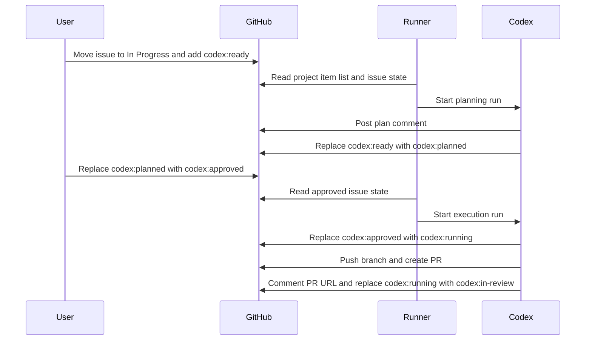

# Delphi Issue Runner Technical Design

## Summary

This document defines the Phase 2 design for an issue-driven Codex runner for Delphi.

The runner starts only after a GitHub issue is deliberately moved to `In Progress` on the organization project board. It plans work when the issue is labeled `codex:ready`, waits for a human to move the issue to `codex:approved`, then executes, opens a PR against `development`, and moves the issue to `codex:in-review`.

The goal is a safe, reviewable automation path that remains quiet when nothing changed and avoids repeated comment spam on unresolved problems.

## Goals

- Start Codex work only from a deliberate project workflow signal
- Use organization-project state as the intake source of truth
- Use a simple label-based state machine for planning and execution
- Prevent duplicate sessions and repeated blocking comments
- Keep GitHub issue, branch, plan, and PR state traceable
- Align with the existing Delphi `delphi-work-issue` and `delphi-github-workflow` skills

## Non-Goals

- Full autonomous intake from newly opened issues
- Automatic implementation without a human approval step
- Multi-issue orchestration beyond a simple first-match poller
- Replacement of GitHub project workflow with a custom workflow system

## Trigger Model

### Source of truth

The source of truth for intake is:

- GitHub organization project `oci-ai-incubations/17`

The deterministic reconciliation command is:

```bash
gh project item-list 17 --owner oci-ai-incubations --format json
```

### Trigger condition

The runner acts only on a project item where:

- `repository` is `https://github.com/rriley99-oci/delphi`
- project status is `In Progress`
- the issue has label `codex:ready` or `codex:approved`

It must not start on:

- issue creation alone
- arbitrary comments
- unrelated label changes

## Workflow Labels

Use exactly one Codex workflow label at a time:

- `codex:ready`
- `codex:planned`
- `codex:approved`
- `codex:running`
- `codex:in-review`

Meaning:

- `codex:ready`: Codex may plan
- `codex:planned`: plan has been posted and is waiting on a human
- `codex:approved`: human approved the plan and Codex may execute
- `codex:running`: Codex claimed execution and is actively working
- `codex:in-review`: PR is open and the issue is waiting on review

If more than one workflow label is present:

- treat it as a blocking error
- post one idempotent error comment
- stop

## High-Level Flow



## System Components

### GitHub Adapter

Responsibilities:

- read the organization project item list
- fetch issue details, labels, comments, and open PR state
- post plan comments
- mutate workflow labels safely
- post one-time blocking comments when human intervention is required
- post PR completion comments

### Codex Executor

Responsibilities during planning:

- inspect the issue carefully
- draft a concise plan grounded in acceptance criteria
- choose branch name `codex/issue-<number>-<slug>`
- post a plan comment with `<!-- codex-plan-id: PLAN_ID -->`
- move the label from `codex:ready` to `codex:planned`

Responsibilities during execution:

- verify a plan comment exists
- move the label from `codex:approved` to `codex:running`
- align to `origin/development`
- create or switch to the issue branch
- implement the work
- run relevant checks honestly
- push the branch
- open a PR with `Closes #<number>`
- comment the PR URL and plan id
- move the label to `codex:in-review`

## Planning Contract

The plan comment should include:

- `<!-- codex-plan-id: PLAN_ID -->`
- intended branch name
- concise implementation plan
- intended verification
- instructions telling the human to change the label to `codex:approved` when ready

Planning must not:

- create a branch
- begin implementation
- repeat the same error comment endlessly

## Execution Contract

Execution may begin only when:

- the issue is still `In Progress`
- the issue has exactly one Codex workflow label
- that label is `codex:approved` or `codex:running`
- a Codex plan comment exists
- no open PR already exists

If an open PR already exists:

- move the issue to `codex:in-review`
- do not start work again

## Error Comment Protocol

Blocking comments must be idempotent.

Use stable hidden markers such as:

```html
<!-- codex-error: multiple-state-labels -->
<!-- codex-error: approved-without-plan -->
<!-- codex-error: planned-without-plan-comment -->
<!-- codex-error: running-state-conflict -->
```

Rules:

- scan existing comments before posting a blocking comment
- if the exact marker already exists, remain silent
- comment only when a human needs to intervene
- do not comment repeatedly for waiting states or no-op polls

## Idempotency Rules

- Only one active non-terminal run may exist per issue
- Only one Codex workflow label may be present at a time
- A repeated poll against the same unresolved state must not create duplicate comments
- A repeated poll against `codex:planned` should remain silent
- A repeated poll against `codex:approved` with an existing PR should move to `codex:in-review` instead of restarting

## Data Model

Suggested first table: `issue_runner_run`

Fields:

- `run_id`
- `repo_owner`
- `repo_name`
- `issue_number`
- `project_number`
- `project_item_id`
- `trigger_status`
- `workflow_label`
- `branch_name`
- `plan_comment_id`
- `plan_id`
- `pr_number`
- `pr_url`
- `state`
- `error_message`
- `updated_at`

## Failure Handling

Planning failures:

- GitHub auth missing
- plan comment cannot be posted
- label state cannot be updated safely

Execution failures:

- branch cannot be created
- tests fail
- push fails
- PR creation fails

Handling:

- mark the run failed in the runner state
- record the reason clearly
- post one blocking comment only when a human can act on it
- avoid retry loops that create repeated issue noise

## Security and Safety

- use least-privilege GitHub credentials
- do not allow issue text alone to bypass approval
- do not execute arbitrary instructions from comments beyond the defined plan protocol
- isolate the runner environment from unrelated repos and credentials

## Rollout Plan

### Phase 2A

- hourly poller
- project item reconciliation
- label-driven planning
- idempotent blocking comments

Success criteria:

- an `In Progress` issue with `codex:ready` receives one plan comment and moves to `codex:planned`

### Phase 2B

- label-driven execution
- branch, push, and PR creation
- issue update to `codex:in-review`

Success criteria:

- an approved issue progresses from `codex:approved` to PR without duplicate runs
